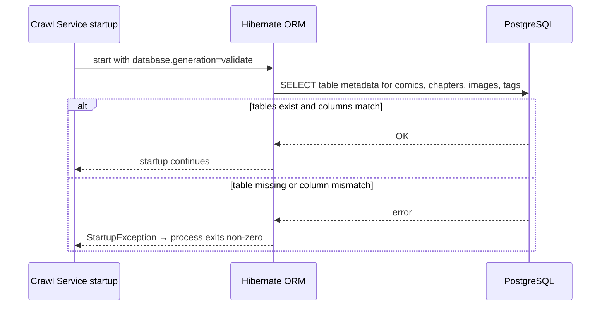
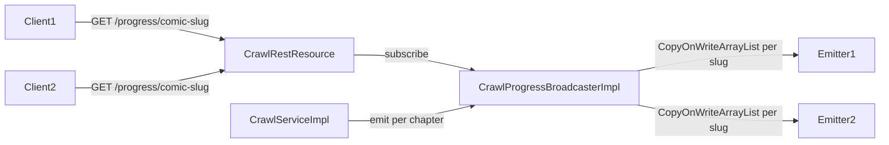

   # Requirements Document

   ## Introduction

   Extract the crawl subsystem from the `warada_v2` Quarkus monolith into a standalone **Crawl Service** — a separate Quarkus application that handles all manga scraping, image downloading, MinIO storage, and crawl-progress SSE. The remaining monolith (GraphQL API, comic/chapter/tag CRUD, Liquibase migrations) must continue to operate without any code change or data-contract change.

   Both services share the same PostgreSQL database and the same MinIO bucket. There is no message queue; the Crawl Service writes directly to the shared DB through its own Hibernate ORM/Panache stack.

   This document first inventories every artefact the crawl layer uses today, then states the extraction requirements in EARS form.

   ---

   ## Glossary

   - **Crawl_Service**: The new standalone Quarkus application that owns all crawling logic (NetTruyen scraping, image download, MinIO temp/permanent object management, SSE progress, scheduled temp-file cleanup).
   - **Monolith**: The existing `warada_v2` application, retaining GraphQL API, REST comic/chapter/tag management, Panache repositories, JPA entities, Liquibase, and all shared infrastructure except crawl-only code.
   - **Shared_DB**: The single PostgreSQL 16 instance accessed by both services under the same schema managed exclusively by the Monolith's Liquibase migrations.
   - **MinIO**: The object-storage instance where the Crawl_Service writes images and from which the Monolith reads `filePath` references.
   - **NettruyenExtractor**: The component (currently `NettruyenExtractorImpl`) that scrapes `nettruyenar.com` HTML, parses JSON-LD, and downloads images to MinIO.
   - **CrawlService**: The application-level orchestrator (currently `CrawlServiceImpl`) that sequences extraction, MinIO rename, DB persistence, and SSE broadcast for a full comic crawl.
   - **FileTempClearer**: The scheduled job (cron `0 0 0,7,14,19 * * ?`) that purges stale MinIO objects under the `temp/` prefix.
   - **SSE_Broadcaster**: The in-memory emitter registry (currently `CrawlProgressBroadcasterImpl`) that fans out `CrawlProgressEvent` to connected SSE clients.
   - **CrawlStatus**: Enum (`INIT`, `FINISHED`) written to `chapters.crawling_status` and `comics.crawling_status`.
   - **ImageType**: Enum (`THUMB_IMAGE`, `CHAPTER_IMAGE`) written to `images.type`.
   - **WaradaConfig**: The `@ConfigMapping(prefix = "warada")` interface that surfaces all `warada.*` configuration keys.

   ---

   ## Requirements

   ### Requirement 1: Configuration Keys Owned by Crawl

   **User Story:** As a developer, I want a complete list of every configuration key the crawl layer consumes, so that I can replicate them exactly in the new Crawl_Service's `application.properties` without missing anything.

   #### Acceptance Criteria

   1. THE Crawl_Service SHALL read `warada.nettruyen.url` (the base URL of `nettruyenar.com`) from `application.properties` and expose it as an injectable configuration value at startup.
   2. WHEN the Crawl_Service downloads a comic image or chapter image, THE Crawl_Service SHALL set the `Origin` and `Referer` HTTP request headers to the value of `warada.nettruyen.url`.
   3. THE Crawl_Service SHALL read `warada.image-bucket` (default `warada-images`) to identify the MinIO bucket for all object operations (listing, get, put, copy, remove).
   4. THE Crawl_Service SHALL read `warada.image-bucket-temp-path` (default `temp`) as the prefix for temporary image objects written during extraction; objects uploaded during crawl SHALL be stored at the path `{warada.image-bucket-temp-path}/{filename}`.
   5. THE Crawl_Service SHALL read `warada.image-bucket-images-path` (default `images`); permanent object paths SHALL be constructed as `{comicSlug}/thumb/{filename}` for thumbnails and `{comicSlug}/chapters/{chapterNumber}/{filename}` for chapter images, not as `{warada.image-bucket-images-path}/{...}`.
   6. IF `warada.clean-up.enabled` is `true`, THEN THE Crawl_Service SHALL activate the `FileTempClearer` scheduled job on startup.
   7. IF `warada.clean-up.enabled` is `false` or absent, THEN THE Crawl_Service SHALL not execute any MinIO temp-object deletion during the lifetime of the process.
   8. THE Crawl_Service SHALL read `warada.clean-up.min-age-minutes` as a positive integer (≥ 1); IF the value is absent, zero, or non-numeric, THEN THE Crawl_Service SHALL reject startup with an ERROR-level log and a non-zero exit code.
   9. THE Crawl_Service SHALL read `quarkus.rest-client.nettruyen.url` as the base URL for the MicroProfile REST Client (`NettruyenRestService`); IF this key is absent or empty, THEN THE Crawl_Service SHALL reject startup with an ERROR-level log and a non-zero exit code.

   ### Requirement 2: Source Classes to Move

   **User Story:** As a developer, I want an authoritative list of every Java class that belongs exclusively to the crawl layer, so that the extraction has a clear boundary and no crawl code is left behind in the Monolith.

   #### Acceptance Criteria

   1. THE Crawl_Service SHALL contain all classes relocated from the current `crawl/` package tree:
      - `crawl/client/NettruyenRestService` (MicroProfile REST Client interface)
      - `crawl/models/CrawlNettruyenComicRequest` (request DTO)
      - `crawl/models/CrawlProgressEvent` (SSE event DTO)
      - `crawl/models/ExtractedChapterDetail`
      - `crawl/models/ExtractedChapters`
      - `crawl/models/ExtractedImage`
      - `crawl/models/ExtractedNettruyenComic`
      - `crawl/models/ExtractedThumbImage`
      - `crawl/resources/rest/CrawlRestResource`
      - `crawl/scheduler/FileTempClearer`
      - `crawl/services/CrawlProgressBroadcaster` (interface)
      - `crawl/services/CrawlService` (interface)
      - `crawl/services/NettruyenExtractor` (interface)
      - `crawl/services/impls/CrawlProgressBroadcasterImpl`
      - `crawl/services/impls/CrawlServiceImpl`
      - `crawl/services/impls/NettruyenExtractorImpl`
   2. THE Crawl_Service SHALL contain `shared/crawl/ExtractedComicDetail` relocated from the Monolith; WHEN the extraction is complete, THE Monolith SHALL no longer contain `shared/crawl/ExtractedComicDetail`.
   3. THE Crawl_Service SHALL contain a copy of `shared/ez/Utils` (pure static helper); the Monolith SHALL retain its own copy of `shared/ez/Utils` independently, as this class has no external dependencies and safe duplication is preferable to introducing cross-service coupling.
   4. THE Crawl_Service SHALL contain `shared/configurations/MinioBucketInitializer` relocated from the Monolith; WHEN the extraction is complete, THE Monolith SHALL no longer contain `shared/configurations/MinioBucketInitializer`.
   5. WHEN the crawl package extraction is complete, THE Monolith SHALL contain no class, interface, or annotation type in any package path matching `*.crawl.*` or `*.crawl/`, verifiable by a static search returning zero matches across all Monolith source files.

   ### Requirement 3: Shared Artefacts Crawl Depends On

   **User Story:** As a developer, I want a complete list of every shared class and infrastructure resource the crawl layer currently imports from `shared/`, so that I can replicate or access each one correctly in the extracted service.

   #### Acceptance Criteria

   1. THE Crawl_Service SHALL have access to the JPA entities `Comic`, `Chapter`, `Image`, and `Tag` at compile time and runtime, so that Hibernate can map entity fields to database columns.
   2. THE Crawl_Service SHALL have access to the `CrawlStatus` and `ImageType` enums and their JPA attribute converters (`CrawlStatusConverter`, `ImageTypeConverter`), so that Hibernate can map entity fields to the correct column values.
   3. THE Crawl_Service SHALL have access to `ComicRepository`, `ChapterRepository`, `ImageRepository`, and `TagRepository` (Panache repositories) to perform all DB reads and writes within the crawl pipeline.
   4. THE Crawl_Service SHALL have access to both the `TagService` interface and its implementing class, so that `resolveOrCreateTags` and `incrementComicCount` can execute within the Crawl_Service process boundary during comic persistence.
   5. THE Crawl_Service SHALL have access to `ConflictException`, so that a duplicate `originPathParams` value is detected and a `409 Conflict` response is returned.
   6. THE Crawl_Service SHALL have access to the `WaradaConfig` `@ConfigMapping` interface and its nested interfaces, including at minimum `NettruyenConfig` and `CleanUpTempImages`.
   7. THE Crawl_Service SHALL have zero compile-time dependencies on any class in the Monolith's `api/` package, verifiable by a compile-time dependency check showing zero symbols from the `api/` package imported in any Crawl_Service source file.
   8. THE Crawl_Service SHALL have zero references to `ComicExtractedEvent`, `ChapterPendingEvent`, or `ChapterImagesExtractedEvent`, verifiable by a static search returning zero matches for these class names across all Crawl_Service source files.

   ### Requirement 4: External Infrastructure Access

   **User Story:** As a developer, I want to know exactly which external systems the crawl layer communicates with, so that the Crawl_Service environment can be configured with the correct secrets and endpoints.

   #### Acceptance Criteria

   1. THE Crawl_Service SHALL connect to the shared database schema defined by the Monolith's Liquibase migrations using `quarkus.datasource.*` configuration (JDBC PostgreSQL driver).
   2. THE Crawl_Service SHALL connect to MinIO using `quarkus.minio.*` configuration with credentials matching those defined in the shared environment configuration used by the Monolith.
   3. WHEN the Crawl_Service starts, THE Crawl_Service SHALL verify the MinIO bucket exists and create it if absent (via `MinioBucketInitializer`).
   4. IF MinIO is unreachable when the Crawl_Service starts, THEN THE Crawl_Service SHALL log an ERROR-level message identifying the failure and exit with a non-zero code.
   5. THE Crawl_Service SHALL make outbound HTTP requests to `nettruyenar.com` via the MicroProfile REST Client (`NettruyenRestService`) for comic metadata and chapter lists.
   6. THE Crawl_Service SHALL make outbound HTTP requests to image CDN URLs via a plain JAX-RS `Client` for image binary downloads.
   7. IF `nettruyenar.com` is unreachable during a crawl operation, THEN THE Crawl_Service SHALL propagate the failure as an exception to the calling crawl pipeline method, which logs it at ERROR level and records the chapter as failed.
   8. THE Crawl_Service SHALL NOT declare or use any RabbitMQ, AMQP, or SmallRye Reactive Messaging dependency.
   9. THE Crawl_Service SHALL NOT execute Liquibase migrations; schema management remains exclusively in the Monolith.
   10. IF the database is unreachable when the Crawl_Service starts, THEN THE Crawl_Service SHALL log an ERROR-level message identifying the failure and exit with a non-zero code.

   ---

   ### Requirement 5: New Service Structure

   **User Story:** As a developer, I want the Crawl_Service to be a self-contained Quarkus application with its own `build.gradle` and `application.properties`, so that it can be built, tested, and deployed independently.

   #### Acceptance Criteria

   1. THE Crawl_Service SHALL reside in a directory named `crawl-service/` at the same level as the Monolith root, with its own `settings.gradle`, `gradlew` wrapper, and `build.gradle`, so that it can be built by running `./gradlew build` inside `crawl-service/` without referencing the Monolith's Gradle build.
   2. THE Crawl_Service `build.gradle` SHALL declare only the following dependencies: `quarkus-rest`, `quarkus-rest-jackson`, `quarkus-hibernate-orm-panache`, `quarkus-jdbc-postgresql`, `quarkus-rest-client`, `quarkus-rest-client-jackson`, `quarkus-scheduler`, `quarkus-smallrye-health`, `quarkus-opentelemetry`, `quarkus-arc`, and `quarkus-minio` (quarkiverse 3.9.1).
   3. THE Crawl_Service SHALL bind its HTTP server to port `8081` by default, so that it does not conflict with the Monolith running on port `8080`.
   4. WHEN the Crawl_Service is built with `-Dquarkus.profile=prod`, THE Crawl_Service SHALL produce an OCI container image containing a GraalVM native binary of the application.
   5. THE Crawl_Service `application.properties` SHALL contain `quarkus.http.port=8081` so that the default port is explicit and not dependent on Quarkus defaults.

   ### Requirement 6: Database Access Without Schema Ownership

   **User Story:** As a developer, I want the Crawl_Service to read and write the Shared_DB without running Liquibase, so that schema migrations remain a single responsibility of the Monolith.

   #### Acceptance Criteria

   1. WHEN the Crawl_Service starts, THE Crawl_Service SHALL NOT execute any Liquibase changelog or migration, verifiable by the absence of Liquibase log entries in the startup output.
   2. WHEN the Crawl_Service connects to the database, THE Crawl_Service SHALL NOT issue any `CREATE TABLE`, `ALTER TABLE`, or `DROP TABLE` DDL statement, verifiable by enabling Hibernate SQL logging and confirming zero DDL statements at startup.
   3. IF the Crawl_Service starts and the required database tables (e.g., `comics`, `chapters`, `images`, `tags`) do not exist, THEN THE Crawl_Service SHALL log an ERROR-level message identifying the missing table and exit with a non-zero code.
   4. IF the Crawl_Service starts and the database host is unreachable, THEN THE Crawl_Service SHALL log an ERROR-level message identifying the connection failure and exit with a non-zero code.
   5. WHEN Hibernate scans for entities, THE Crawl_Service SHALL register only the entity package defined within the Crawl_Service source tree, so that no Monolith entity package path is referenced at runtime.

   ### Requirement 7: REST Endpoints Preserved

   **User Story:** As a client, I want the Crawl_Service to expose the same crawl REST API paths that exist today in the Monolith, so that no client needs to be updated after extraction.

   #### Acceptance Criteria

   1. WHEN a client sends `POST /api/v1/crawl/nettruyen/comic` with a valid `CrawlNettruyenComicRequest` JSON body, THE Crawl_Service SHALL return `HTTP 200 OK` with response body `Success`.
   2. WHEN a client sends `POST /api/v1/crawl/nettruyen/comic/{slug}/retry` with a valid comic slug, THE Crawl_Service SHALL return `HTTP 200 OK` with response body `Retry queued`.
   3. IF the `{slug}` in `POST /api/v1/crawl/nettruyen/comic/{slug}/retry` does not correspond to any comic in the Shared_DB, THEN THE Crawl_Service SHALL return `HTTP 404 Not Found`.
   4. IF the `{slug}` in `POST /api/v1/crawl/nettruyen/comic/{slug}/retry` corresponds to a comic that already has an active queued crawl, THEN THE Crawl_Service SHALL return `HTTP 409 Conflict`.
   5. WHEN a client sends `GET /api/v1/crawl/progress/{comicSlug}` with `Accept: text/event-stream`, THE Crawl_Service SHALL return an HTTP response with `Content-Type: text/event-stream` and keep the connection open as a Server-Sent Events stream.
   6. IF the `{comicSlug}` in `GET /api/v1/crawl/progress/{comicSlug}` does not correspond to any comic in the Shared_DB, THEN THE Crawl_Service SHALL return `HTTP 404 Not Found`.
   7. IF the requested comic already exists in the Shared_DB, THEN THE Crawl_Service SHALL return `HTTP 409 Conflict` on `POST /api/v1/crawl/nettruyen/comic`.
   8. WHILE a crawl is in progress, THE Crawl_Service SHALL emit SSE events of types `processing`, `completed`, `failed`, and `skipped` as applicable for each chapter, with each event payload containing at minimum `chapterId`, `chapterNumber`, `status`, and `comicSlug` fields.

   ### Requirement 8: Monolith Remains Unaffected

   **User Story:** As a developer, I want the Monolith to require zero code changes during and after the crawl extraction, so that GraphQL and CRUD APIs remain continuously available.

   #### Acceptance Criteria

   1. WHEN the crawl package is removed from the Monolith, THE Monolith SHALL compile without errors, verifiable by `./gradlew compileJava` completing with exit code 0.
   2. WHEN the crawl package is removed from the Monolith, all Monolith unit and integration tests SHALL pass, verifiable by `./gradlew test` completing with zero test failures.
   3. THE Monolith SHALL retain all packages under `shared/repositories/`, `shared/entities/`, `shared/enums/`, `shared/services/`, `shared/configurations/WaradaConfig`, `shared/exception_mappers/`, `shared/models/`, and `shared/converter/`, and all Liquibase migration files, in their current locations.
   4. IF the Monolith's `MinioBucketInitializer` is not referenced by any non-crawl class in the Monolith after extraction, THEN THE Monolith SHALL remove `MinioBucketInitializer` from its source tree.
   5. IF the Monolith's `MinioBucketInitializer` is still referenced by at least one non-crawl class in the Monolith after extraction, THEN THE Monolith SHALL retain `MinioBucketInitializer` unchanged.
   6. WHEN the Monolith receives a GraphQL or REST CRUD request that returns an `Image` entity with a known `filePath` value, THE Monolith SHALL return a response containing that `filePath` value unchanged, confirming that image serving is unaffected by the extraction.
   7. AFTER extraction, THE Monolith SHALL return `HTTP 404 Not Found` for all of the following paths: `POST /api/v1/crawl/nettruyen/comic`, `POST /api/v1/crawl/nettruyen/comic/{slug}/retry`, and `GET /api/v1/crawl/progress/{comicSlug}`.

   ### Requirement 9: Shared Code Strategy

   **User Story:** As a developer, I want a clear, executable strategy for handling the classes that both services need (entities, enums, repositories, converters), so that there is no ambiguity about what gets copied vs. shared as a library.

   #### Acceptance Criteria

   1. THE Crawl_Service SHALL replicate JPA entities, enums, converters, repositories, `TagService`, `WaradaConfig`, `Utils`, `ConflictException`, and `MinioBucketInitializer` as source files copied into the Crawl_Service's own source tree under the same Java package names (`com.github.warada_v2.*`), so that no Gradle multi-project dependency on the Monolith is required.
   2. WHEN the Crawl_Service's entity package is `com.github.warada_v2.shared.entities`, THE Crawl_Service `quarkus.hibernate-orm.packages` property SHALL be set to `com.github.warada_v2.shared.entities,com.github.warada_v2.shared.converter`.
   3. THE Crawl_Service entity source files SHALL use identical `@Table(name=...)`, `@Column(name=...)`, and `@JoinColumn(name=...)` annotations as the corresponding Monolith entity files, so that both services map to the same table and column names in the Shared_DB.
   4. IF the Monolith entity defines a `@SequenceGenerator` with `allocationSize`, `sequenceName`, or `name` attributes, THEN THE Crawl_Service copy of that entity SHALL use the same `@SequenceGenerator` and `@GeneratedValue` settings without modification, to prevent ID sequence conflicts between the two services.

   ### Requirement 10: Scheduled Job Ownership

   **User Story:** As an operator, I want the `FileTempClearer` scheduled job to run only in the Crawl_Service so that temp MinIO objects are cleaned up without the Monolith needing MinIO write access.

   #### Acceptance Criteria

   1. WHEN the cron schedule `0 0 0,7,14,19 * * ?` fires, THE Crawl_Service SHALL delete all objects under the MinIO `temp/` prefix whose `lastModified` timestamp is older than the value of `warada.clean-up.min-age-minutes` minutes at the time of execution.
   2. IF `warada.clean-up.enabled` is `false`, THEN THE Crawl_Service SHALL skip the cleanup execution without deleting any objects and emit a log entry at DEBUG level indicating cleanup is disabled.
   3. IF the MinIO storage is unreachable when the cron schedule fires, THEN THE Crawl_Service SHALL abort the cleanup run, emit a log entry at ERROR level indicating the failure, and not retry until the next scheduled firing.
   4. THE Monolith SHALL NOT contain the `FileTempClearer` class after extraction.

   ### Requirement 11: SSE Broadcaster Scope

   **User Story:** As an operator, I want to understand the current SSE broadcaster limitation and the impact it has on the extraction plan, so that I can decide whether to fix it before or after extraction.

   #### Acceptance Criteria

   1. THE Crawl_Service SHALL implement the SSE broadcaster as a `ConcurrentHashMap<String, CopyOnWriteArrayList<MultiEmitter<CrawlProgressEvent>>>` in-memory registry, where the key is the comic slug, and the broadcaster SHALL fan out each `CrawlProgressEvent` to all registered emitters for that slug.
   2. THE Crawl_Service `README.md` or inline Javadoc on `CrawlProgressBroadcasterImpl` SHALL state that the in-memory broadcaster is not compatible with multi-instance deployments and that a persistent pub/sub mechanism (e.g., Redis pub/sub) would be required for horizontal scaling.
   3. WHEN a client connects to `GET /api/v1/crawl/progress/{comicSlug}`, THE Crawl_Service SHALL return the `Multi<CrawlProgressEvent>` stream immediately, keeping the connection open even if no crawl is currently running for that slug.
   4. WHEN an SSE stream for a given `comicSlug` has no registered emitters remaining (all clients disconnected), THE Crawl_Service SHALL remove the entry for that slug from the `ConcurrentHashMap` to prevent unbounded memory growth.

   ### Requirement 12: Removal of Dead Code from Monolith

   **User Story:** As a developer, I want dead code cleaned up from the Monolith during this extraction so that the codebase reflects reality after the split.

   #### Acceptance Criteria

   1. WHEN the crawl package is removed from the Monolith, THE Monolith source tree SHALL NOT contain `shared/models/events/ComicExtractedEvent`, `shared/models/events/ChapterPendingEvent`, or `shared/models/events/ChapterImagesExtractedEvent`.
   2. WHEN the crawl package is removed from the Monolith, THE Monolith test source tree SHALL NOT contain `ChapterCrawlConsumerTest`.
   3. WHEN the crawl package is removed from the Monolith, the `docker-compose.yml` at the Monolith project root SHALL NOT define a `rabbitmq` service or a `rabbitmq-data` volume.
   4. WHEN the crawl package is removed from the Monolith, `ComicRepository` SHALL NOT contain the `existedBySlugAndComicId` method, and no other Monolith class SHALL contain a call to `existedBySlugAndComicId`.

   ### Requirement 13: Docker Compose for Both Services

   **User Story:** As a developer, I want a `docker-compose.yml` that brings up both services alongside PostgreSQL and MinIO, so that I can run the full system locally with a single command.

   #### Acceptance Criteria

   1. THE root-level `docker-compose.yml` SHALL define exactly four services: `postgres` (default port 5432), `minio` (ports 9000/9001), `monolith` (host port 8080 → container port 8080), and `crawl-service` (host port 8081 → container port 8081).
   2. THE `crawl-service` container SHALL declare a `depends_on` condition requiring `postgres` and `minio` to be healthy, with a health-check definition using interval ≤ 10 seconds, timeout 5 seconds, and requiring 3 consecutive successes before marking the dependency healthy.
   3. THE `monolith` container SHALL declare a `depends_on` condition requiring `postgres` to be healthy, with a health-check definition using interval ≤ 10 seconds, timeout 5 seconds, and requiring 3 consecutive successes.
   4. THE `docker-compose.yml` SHALL define a named volume for `postgres` data persistence, so that database contents survive container restarts.
   5. ALL database and MinIO connection parameters (host, port, username, password, access key, secret key) for both containers SHALL be supplied via environment variables or an env-file reference, so that credentials are not hard-coded in the compose file.
   6. WHEN a developer runs `docker compose up -d postgres minio`, each service SHALL be startable independently via `./gradlew quarkusDev` inside its own project directory without starting the other application container.

   ### Requirement 14: Step-by-Step Extraction Sequence

   **User Story:** As a developer, I want an ordered sequence of atomic steps that I can execute one at a time with a known rollback at each step, so that the extraction can be done safely without a big-bang cutover.

   #### Acceptance Criteria

   1. THE extraction sequence SHALL follow this order, where each step leaves the system in a deployable state verified by `./gradlew build` completing with zero errors and all existing tests passing before proceeding to the next step:
      - **Step 1** — Delete dead code from the Monolith (`ComicExtractedEvent`, `ChapterPendingEvent`, `ChapterImagesExtractedEvent`, `ChapterCrawlConsumerTest`, `existedBySlugAndComicId`, RabbitMQ from `docker-compose.yml`).
      - **Step 2** — Create the `crawl-service/` Gradle project skeleton with `build.gradle`, `settings.gradle`, `application.properties` (dev + prod profiles), and empty source directories.
      - **Step 3** — Copy all shared artefacts needed by the Crawl_Service (entities, enums, converters, repositories, `TagService` + impl, `WaradaConfig`, `Utils`, `ConflictException`, `MinioBucketInitializer`) into the new project under identical package names.
      - **Step 4** — Copy all crawl-exclusive source files (the entire `crawl/` package tree plus `shared/crawl/ExtractedComicDetail`) into the new project.
      - **Step 5** — Configure `application.properties` in the Crawl_Service with all required `warada.*`, `quarkus.rest-client.nettruyen.*`, `quarkus.datasource.*`, `quarkus.minio.*`, `quarkus.hibernate-orm.*`, and `quarkus.liquibase.enabled=false` keys.
      - **Step 6** — Build and test the Crawl_Service in isolation against a local Postgres + MinIO; verify all three endpoints respond within 5 seconds, trigger a crawl, confirm at least one DB row is persisted, and at least one object is stored in MinIO before the step is considered complete.
      - **Step 7** — Delete the `crawl/` package tree and `shared/crawl/` from the Monolith; remove `MinioBucketInitializer` from the Monolith if no Monolith code references it; run `./gradlew build` on the Monolith and confirm zero compilation errors and all tests pass.
      - **Step 8** — Update `docker-compose.yml` to include the `crawl-service` container and remove RabbitMQ.
      - **Step 9** — Write integration smoke tests for both services running together: trigger a crawl via `crawl-service:8081`, then query the comic via `monolith:8080/graphql`.
   2. WHEN Step 7 is complete, THE Monolith SHALL have no import or reference to any class in the former `crawl/` package, verified by a static search confirming zero matches for the `crawl/` package namespace across all Monolith source files.
   3. IF any step fails to compile or all existing tests do not pass, THEN THE developer SHALL be able to revert only that step by restoring the files modified or deleted in that step alone, leaving all files from prior steps unchanged.
   4. WHEN Step 6 is executed, THE Crawl_Service SHALL respond to all three endpoints within 5 seconds, persist at least one DB row, and store at least one object in MinIO before the step is considered complete.
   5. IF Step 3 or Step 4 results in a copied class that already exists in the Crawl_Service under the same package and class name, THEN THE build SHALL fail with an error indicating a duplicate class, and the developer SHALL resolve the conflict before proceeding to the next step.
# Design Document — Crawl Service Extraction

## Overview

This design describes how to extract the crawl subsystem from the `warada_v2` Quarkus monolith into a standalone **Crawl Service**. The goal is a clean service boundary with zero coupling between the two services at runtime: no shared JVM, no message queue, no HTTP calls between them. Both services share the same PostgreSQL 16 database and the same MinIO bucket.

The extraction strategy is **copy-not-share**: shared code (entities, enums, converters, repositories, `TagService`, `WaradaConfig`, `Utils`, `ConflictException`, `MinioBucketInitializer`) is duplicated into the Crawl Service's own source tree under identical Java package names. This avoids any Gradle multi-project dependency and keeps each service independently buildable. The tradeoff — keeping two copies in sync — is acceptable because these classes are stable and schema changes already require coordinating both services regardless.

---

## Architecture

```mermaid
graph TB
    subgraph "Developer / Client"
        C[HTTP Client / Browser]
    end

    subgraph "warada_v2 — Monolith :8080"
        GQL[GraphQL API<br/>/graphql]
        CRUD[REST CRUD<br/>/api/v1/comics &amp; /chapters]
        SHARED_SVC[TagService<br/>ComicService<br/>ChapterService]
        ORM_M[Hibernate ORM + Panache<br/>Repositories]
        LB[Liquibase<br/>schema owner]
    end

    subgraph "crawl-service :8081"
        REST_C[CrawlRestResource<br/>POST /api/v1/crawl/nettruyen/comic<br/>POST /api/v1/crawl/nettruyen/comic/{slug}/retry<br/>GET  /api/v1/crawl/progress/{slug} SSE]
        CSI[CrawlServiceImpl]
        NEI[NettruyenExtractorImpl]
        NRSC[NettruyenRestService<br/>MicroProfile REST Client]
        BCAST[CrawlProgressBroadcasterImpl<br/>in-memory ConcurrentHashMap]
        FTC[FileTempClearer<br/>cron 0,7,14,19h]
        ORM_C[Hibernate ORM + Panache<br/>Repositories — copied]
    end

    subgraph "Shared Infrastructure"
        PG[(PostgreSQL 16<br/>schema owned by Monolith)]
        MINIO[(MinIO<br/>warada-images bucket)]
        NT[nettruyenar.com<br/>HTML + image CDN]
    end

    C -->|GraphQL / CRUD| GQL
    C -->|GraphQL / CRUD| CRUD
    C -->|Crawl trigger + SSE| REST_C

    GQL --> SHARED_SVC
    CRUD --> SHARED_SVC
    SHARED_SVC --> ORM_M
    LB -->|migrations| PG
    ORM_M -->|reads| PG

    REST_C --> CSI
    CSI --> NEI
    CSI --> BCAST
    CSI --> ORM_C
    NEI --> NRSC
    NEI --> MINIO
    FTC --> MINIO
    NRSC -->|HTTP scrape| NT
    ORM_C -->|reads + writes| PG
```

**Key boundaries:**

| What crosses the boundary | Direction | Mechanism |
|---|---|---|
| Comic / Chapter / Image / Tag rows | Both read; Crawl writes | Shared PostgreSQL schema |
| Image files | Crawl writes; Monolith reads `filePath` reference | MinIO bucket |
| No API calls | — | Services never call each other |
| No events / queue | — | No RabbitMQ or messaging layer |

---

## Components and Interfaces

### Crawl Service — Component Map

```
crawl-service/
└── src/main/java/com/github/warada_v2/
    ├── crawl/
    │   ├── client/
    │   │   └── NettruyenRestService          # MicroProfile REST Client (MOVED)
    │   ├── models/
    │   │   ├── CrawlNettruyenComicRequest     # request DTO (MOVED)
    │   │   ├── CrawlProgressEvent             # SSE event DTO (MOVED)
    │   │   ├── ExtractedChapterDetail         # (MOVED)
    │   │   ├── ExtractedChapters              # (MOVED)
    │   │   ├── ExtractedImage                 # (MOVED)
    │   │   ├── ExtractedNettruyenComic        # (MOVED)
    │   │   └── ExtractedThumbImage            # (MOVED)
    │   ├── resources/rest/
    │   │   └── CrawlRestResource              # JAX-RS resource (MOVED)
    │   ├── scheduler/
    │   │   └── FileTempClearer                # @Scheduled cron job (MOVED)
    │   └── services/
    │       ├── CrawlProgressBroadcaster       # interface (MOVED)
    │       ├── CrawlService                   # interface (MOVED)
    │       ├── NettruyenExtractor             # interface (MOVED)
    │       └── impls/
    │           ├── CrawlProgressBroadcasterImpl  # (MOVED)
    │           ├── CrawlServiceImpl              # (MOVED)
    │           └── NettruyenExtractorImpl         # (MOVED)
    └── shared/
        ├── configurations/
        │   ├── MinioBucketInitializer         # (MOVED from Monolith)
        │   └── WaradaConfig                   # (COPIED)
        ├── converter/
        │   ├── CrawlStatusConverter           # (COPIED)
        │   └── ImageTypeConverter             # (COPIED)
        ├── crawl/
        │   └── ExtractedComicDetail           # (MOVED from Monolith)
        ├── entities/
        │   ├── Comic                          # (COPIED — identical annotations)
        │   ├── Chapter                        # (COPIED — identical annotations)
        │   ├── Image                          # (COPIED — identical annotations)
        │   └── Tag                            # (COPIED — identical annotations)
        ├── enums/
        │   ├── CrawlStatus                    # (COPIED)
        │   └── ImageType                      # (COPIED)
        ├── exceptions/
        │   └── ConflictException              # (COPIED)
        ├── ez/
        │   └── Utils                          # (COPIED — safe duplication)
        ├── repositories/
        │   ├── ComicRepository                # (COPIED)
        │   ├── ChapterRepository              # (COPIED)
        │   ├── ImageRepository                # (COPIED)
        │   └── TagRepository                  # (COPIED)
        └── services/
            ├── TagService                     # (COPIED)
            └── impls/
                └── TagServiceImpl             # (COPIED)
```

**MOVED** — the class leaves the Monolith entirely; it will be absent from the Monolith after extraction.  
**COPIED** — an identical source copy is placed in the Crawl Service; the Monolith retains its own copy.

### What stays in the Monolith

The Monolith retains all of the following, unchanged:

- `api/` — all GraphQL resources and REST CRUD resources
- `shared/entities/`, `shared/repositories/`, `shared/enums/`, `shared/converter/`
- `shared/services/` — `ComicService`, `ChapterService`, `TagService` + impls
- `shared/configurations/WaradaConfig`
- `shared/exceptions/`, `shared/exception_mappers/`, `shared/models/`, `shared/ez/Utils`
- All Liquibase migration files under `src/main/resources/db/`

`MinioBucketInitializer` is **removed** from the Monolith after extraction (it is not referenced by any non-crawl class in the Monolith; the Monolith no longer needs MinIO write access).

`ExtractedComicDetail` in `shared/crawl/` is **removed** from the Monolith; it is only used by the crawl pipeline.

### Interface Contracts

**`CrawlService`**
```java
void crawlNettruyenComic(String slugNId) throws Exception;
void crawlChapterById(Long chapterId) throws Exception;
void retryFailedChapters(String comicSlug);
```

**`CrawlProgressBroadcaster`**
```java
Multi<CrawlProgressEvent> subscribe(String comicSlug);
void emit(String comicSlug, CrawlProgressEvent event);
boolean markActive(String comicSlug);
boolean isActive(String comicSlug);
void markInactive(String comicSlug);
boolean hasSubscribers(String comicSlug);
```

**`NettruyenExtractor`**
```java
ExtractedComicDetail extractComicDetail(String slug);
ExtractedChapterDetail extractChapterDetail(String slug);
```

**`NettruyenRestService`** (MicroProfile REST Client, `configKey = "nettruyen"`)
```
GET /truyen-tranh/{slug-n-id}                           → Response (text/html)
GET /Comic/Services/ComicService.asmx/ChapterList       → Response (application/json)
    ?slug=&comicId=
```

---

## Data Models

### Shared Database Schema (Monolith-owned, Crawl Service read-write)

The Crawl Service does not own the schema. It uses the same tables the Monolith created via Liquibase.

| Table | Owner of schema | Writer at runtime |
|---|---|---|
| `comics` | Monolith (Liquibase) | Crawl Service |
| `chapters` | Monolith (Liquibase) | Crawl Service |
| `images` | Monolith (Liquibase) | Crawl Service |
| `tags` | Monolith (Liquibase) | Crawl Service |
| `comic_tags` | Monolith (Liquibase) | Crawl Service |

**Critical annotation constraints for copied entities:**

All `@SequenceGenerator`, `@Table`, `@Column`, `@JoinColumn`, and `@JoinTable` annotations must be copied verbatim. Any deviation will cause sequence or column-name mismatches.

Key generators:
- `Comic`: `@SequenceGenerator(name = "comic_id_seq", sequenceName = "comic_id_seq", allocationSize = 1)`
- `Chapter`: `@SequenceGenerator(name = "chapter_id_seq", sequenceName = "chapter_id_seq", allocationSize = 1)`
- `Image` and `Tag`: must be confirmed and copied exactly (same rule applies)

The `allocationSize = 1` on all generators is critical. Hibernate's default is 50, which would cause both services to claim non-overlapping ID ranges from the same sequence and produce conflicting IDs.

### MinIO Object Layout

```
warada-images/                             ← bucket (warada.image-bucket)
├── temp/                                  ← warada.image-bucket-temp-path
│   ├── 20250601_123456_thumbnail.jpg      ← transient during crawl
│   └── 20250601_123456_0.jpg
└── {comicSlug}/
    ├── thumb/
    │   └── {filename}                     ← permanent thumbnail
    └── chapters/
        └── {chapterNumber}/
            └── {filename}                 ← permanent chapter images
```

Two-phase write: images are PUT to `temp/{filename}` during extraction, then CopyObject + RemoveObject to the permanent path after extraction succeeds. `FileTempClearer` purges objects under `temp/` that are older than `warada.clean-up.min-age-minutes` minutes.

### SSE Event Payload

```java
// CrawlProgressEvent fields
EventType type;          // PROCESSING | COMPLETED | FAILED | SKIPPED
String message;
ChapterProgress data;

// ChapterProgress fields
Long chapterId;
String chapterNumber;
String filePath;         // nullable
String comicSlug;
```

---

## Configuration Design

### Crawl Service — `application.properties`

```properties
# === Application ===
quarkus.application.name=crawl-service
quarkus.http.port=8081
quarkus.http.host=0.0.0.0
quarkus.log.console.darken=1

# === Hibernate ORM ===
# No Liquibase. validate mode ensures tables exist without issuing DDL.
quarkus.hibernate-orm.packages=com.github.warada_v2.shared.entities,com.github.warada_v2.shared.converter
quarkus.hibernate-orm.database.generation=validate
quarkus.liquibase.enabled=false

# === Warada config ===
warada.nettruyen.url=https://nettruyenar.com
warada.image-bucket=warada-images
warada.image-bucket-temp-path=temp
warada.image-bucket-images-path=images
warada.clean-up.enabled=true
warada.clean-up.min-age-minutes=5

# === MicroProfile REST Client ===
quarkus.rest-client.nettruyen.url=https://nettruyenar.com

# === Dev profile ===
%dev.quarkus.datasource.db-kind=postgresql
%dev.quarkus.datasource.username=${DEV_DB_USERNAME:devuser}
%dev.quarkus.datasource.password=${DEV_DB_PASSWD:devpassword}
%dev.quarkus.datasource.jdbc.url=${DEV_DB_URL:jdbc:postgresql://localhost:5432/postgres}
%dev.quarkus.hibernate-orm.log.sql=false
%dev.quarkus.otel.enabled=false
%dev.quarkus.minio.host=${DEV_MINIO_HOST:localhost}
%dev.quarkus.minio.port=${DEV_MINIO_PORT:9000}
%dev.quarkus.minio.access-key=${DEV_MINIO_ACCESS_KEY:admin}
%dev.quarkus.minio.secret-key=${DEV_MINIO_SECRET_KEY:admin123123123123}
%dev.quarkus.minio.secure=${DEV_MINIO_SECURE:false}
%dev.quarkus.package.jar.enabled=true

# === Prod profile ===
%prod.quarkus.datasource.db-kind=postgresql
%prod.quarkus.datasource.username=${DB_USERNAME}
%prod.quarkus.datasource.password=${DB_PASSWORD}
%prod.quarkus.datasource.jdbc.url=${DB_URL}
%prod.quarkus.otel.enabled=true
%prod.quarkus.otel.exporter.otlp.endpoint=${OTLP_ENDPOINT}
%prod.quarkus.minio.host=${MINIO_ENDPOINT}
%prod.quarkus.minio.access-key=${MINIO_ACCESS_KEY}
%prod.quarkus.minio.secret-key=${MINIO_SECRET_KEY}
%prod.quarkus.minio.secure=${MINIO_SECURE}
%prod.quarkus.native.enabled=true
%prod.quarkus.native.container-build=true
%prod.quarkus.native.builder-image=quay.io/quarkus/ubi-quarkus-mandrel-builder-image:jdk-21
%prod.quarkus.package.jar.enabled=false
```

Key decisions:
- `quarkus.hibernate-orm.database.generation=validate` — Hibernate will verify the tables exist and columns match the entity mappings, but issue zero DDL. If a required table is missing, startup fails with a clear error.
- `quarkus.liquibase.enabled=false` — explicit, not relying on defaults.
- Port `8081` is explicit to avoid conflict with the Monolith on `8080`.

### Monolith — Changes after extraction

The Monolith's `application.properties` requires **no changes**. The only structural change is removing any `quarkus-minio` dependency from `build.gradle` if no non-crawl code references `MinioClient` — this needs confirmation at Step 7 of the extraction.

---

## Database Access Design

The Crawl Service's relationship to the database is **writer without schema ownership**.



**Rules:**
1. Liquibase is disabled. No changelog is executed.
2. `database.generation=validate` replaces `none` so that startup fails fast if the schema is absent, rather than failing at first query.
3. The `quarkus.hibernate-orm.packages` property must list both `shared.entities` and `shared.converter` so Hibernate discovers the `@Convert` attribute converters (`CrawlStatusConverter`, `ImageTypeConverter`).
4. Both services use `allocationSize = 1` on all sequence generators to prevent ID gaps or conflicts when both services share the same PostgreSQL sequences.

---

## REST API Surface

All paths match the existing Monolith endpoints exactly. No client changes required.

| Method | Path | Request | Response | Notes |
|---|---|---|---|---|
| `POST` | `/api/v1/crawl/nettruyen/comic` | `CrawlNettruyenComicRequest` JSON | `200 OK` "Success" / `409 Conflict` | Blocking; crawls full comic + all chapters |
| `POST` | `/api/v1/crawl/nettruyen/comic/{slug}/retry` | path param | `200 OK` "Retry queued" / `404` / `409` | Re-crawls chapters in `INIT` status |
| `GET` | `/api/v1/crawl/progress/{comicSlug}` | path param, `Accept: text/event-stream` | SSE stream | Keeps connection open; events emitted per-chapter |

The `@Blocking` annotation on the POST endpoints is retained. This means crawling a 200-chapter comic will hold the HTTP thread for the full crawl duration. This is a known limitation documented in the current-state review and is out of scope for this extraction — making the crawl async is a follow-up task.

---

## SSE Broadcaster Design



**Data structure:**
```java
ConcurrentHashMap<String, CopyOnWriteArrayList<MultiEmitter<? super CrawlProgressEvent>>> emitters;
ConcurrentHashMap.KeySet<String> activeComics;   // tracks in-progress crawls
```

- **Subscribe**: adds a `MultiEmitter` to the list for the slug; registers `onTermination` callback to remove the emitter and clean the map entry when all clients disconnect.
- **Emit**: iterates the list for the slug, calling `emitter.emit(event)` for each; swallows per-emitter exceptions so one broken client doesn't abort others.
- **Cleanup**: when the last emitter for a slug terminates, the map entry is removed to prevent unbounded memory growth.

> ⚠️ **Scaling limitation**: The broadcaster is in-memory and process-local. In a multi-instance deployment, a crawl triggered on instance A broadcasts only to SSE clients connected to instance A. Clients connected to instance B receive no events. To support horizontal scaling, replace the `ConcurrentHashMap` with a Redis pub/sub channel (one channel per comic slug). This is out of scope for the initial extraction.

---

## FileTempClearer Ownership

`FileTempClearer` moves entirely to the Crawl Service. The Monolith has no MinIO write access after extraction and therefore must not run this job.

**Behavior summary:**

```
Cron: 0 0 0,7,14,19 * * ?   (00:00, 07:00, 14:00, 19:00 daily)
Condition: warada.clean-up.enabled = true
Action: list all objects under temp/ prefix → delete those with lastModified < now - minAgeMinutes
```

| Configuration state | Behavior |
|---|---|
| `enabled=true` | Executes full scan + delete cycle |
| `enabled=false` | Logs DEBUG "cleanup disabled", returns immediately |
| MinIO unreachable at cron time | Logs ERROR, aborts, does not retry until next scheduled firing |
| `min-age-minutes` absent/invalid | Startup rejection with ERROR log + non-zero exit |

---

## Gradle Project Layout

```
warada_v2/                        ← monolith (unchanged Gradle project)
  build.gradle
  settings.gradle
  src/...

crawl-service/                    ← new standalone project (same level)
  settings.gradle
  gradlew
  gradlew.bat
  gradle/wrapper/
  build.gradle
  src/
    main/
      java/com/github/warada_v2/  ← same root package
        crawl/...
        shared/...
      resources/
        application.properties
        META-INF/
    test/
      java/com/github/warada_v2/
```

**`crawl-service/settings.gradle`**
```groovy
pluginManagement {
    repositories {
        mavenCentral()
        gradlePluginPortal()
    }
}
rootProject.name = 'crawl-service'
```

**`crawl-service/build.gradle`** — declared dependencies:

```groovy
dependencies {
    implementation enforcedPlatform("${quarkusPlatformGroupId}:${quarkusPlatformArtifactId}:${quarkusPlatformVersion}")
    implementation 'io.quarkus:quarkus-arc'
    implementation 'io.quarkus:quarkus-rest'
    implementation 'io.quarkus:quarkus-rest-jackson'
    implementation 'io.quarkus:quarkus-hibernate-orm-panache'
    implementation 'io.quarkus:quarkus-jdbc-postgresql'
    implementation 'io.quarkus:quarkus-rest-client'
    implementation 'io.quarkus:quarkus-rest-client-jackson'
    implementation 'io.quarkus:quarkus-scheduler'
    implementation 'io.quarkus:quarkus-smallrye-health'
    implementation 'io.quarkus:quarkus-opentelemetry'
    implementation 'io.quarkiverse.minio:quarkus-minio:3.9.1'
    // No quarkus-smallrye-graphql — crawl service has no GraphQL
    // No quarkus-liquibase — schema ownership stays in the monolith
    // No RabbitMQ / SmallRye Reactive Messaging
}
```

Notable omissions vs the Monolith: `quarkus-smallrye-graphql`, `quarkus-smallrye-graphql-client`, `quarkus-liquibase`, `quarkus-smallrye-openapi`. The Crawl Service is a narrow service with no GraphQL surface and no schema ownership.

---

## Docker Compose Topology

```yaml
services:
  postgres:
    image: postgres:16
    environment:
      POSTGRES_DB: ${POSTGRES_DB:-postgres}
      POSTGRES_USER: ${POSTGRES_USER:-postgres}
      POSTGRES_PASSWORD: ${POSTGRES_PASSWORD:-postgres}
    ports:
      - "5432:5432"
    volumes:
      - postgres-data:/var/lib/postgresql/data
    healthcheck:
      test: ["CMD-SHELL", "pg_isready -U ${POSTGRES_USER:-postgres} -d ${POSTGRES_DB:-postgres}"]
      interval: 10s
      timeout: 5s
      retries: 3

  minio:
    image: minio/minio:RELEASE.2025-04-22T22-12-26Z
    command: server /data --console-address ":9001"
    environment:
      MINIO_ROOT_USER: ${MINIO_ACCESS_KEY:-admin}
      MINIO_ROOT_PASSWORD: ${MINIO_SECRET_KEY:-admin123123123123}
    ports:
      - "9000:9000"
      - "9001:9001"
    volumes:
      - minio-data:/data
    healthcheck:
      test: ["CMD", "curl", "-f", "http://localhost:9000/minio/health/live"]
      interval: 10s
      timeout: 5s
      retries: 3

  monolith:
    image: warada_v2:latest
    ports:
      - "8080:8080"
    environment:
      DB_URL: jdbc:postgresql://postgres:5432/${POSTGRES_DB:-postgres}
      DB_USERNAME: ${POSTGRES_USER:-postgres}
      DB_PASSWORD: ${POSTGRES_PASSWORD:-postgres}
      OTLP_ENDPOINT: ${OTLP_ENDPOINT:-http://localhost:4317}
    depends_on:
      postgres:
        condition: service_healthy

  crawl-service:
    image: crawl-service:latest
    ports:
      - "8081:8081"
    environment:
      DB_URL: jdbc:postgresql://postgres:5432/${POSTGRES_DB:-postgres}
      DB_USERNAME: ${POSTGRES_USER:-postgres}
      DB_PASSWORD: ${POSTGRES_PASSWORD:-postgres}
      MINIO_ENDPOINT: minio
      MINIO_ACCESS_KEY: ${MINIO_ACCESS_KEY:-admin}
      MINIO_SECRET_KEY: ${MINIO_SECRET_KEY:-admin123123123123}
      MINIO_SECURE: "false"
    depends_on:
      postgres:
        condition: service_healthy
      minio:
        condition: service_healthy

volumes:
  postgres-data:
  minio-data:
```

Key decisions:
- RabbitMQ service and `rabbitmq-data` volume are removed.
- All credentials use environment variables; no hard-coded values in the compose file.
- The `monolith` container depends only on `postgres` (healthy) — it doesn't need MinIO.
- The `crawl-service` container depends on both `postgres` (healthy) and `minio` (healthy).
- `minio-data` volume is added for MinIO persistence (the original compose lacked it).
- Developers can still run either service locally with `./gradlew quarkusDev` by starting only `docker compose up -d postgres minio`.

---

## Dead Code Removal Checklist

These items are removed from the Monolith in **Step 1** of the extraction sequence, before any new files are created.

| Artefact | Location | Action |
|---|---|---|
| `ComicExtractedEvent` | `shared/models/events/ComicExtractedEvent.java` | Delete |
| `ChapterPendingEvent` | `shared/models/events/ChapterPendingEvent.java` | Delete |
| `ChapterImagesExtractedEvent` | `shared/models/events/ChapterImagesExtractedEvent.java` | Delete |
| `ChapterCrawlConsumerTest` | `src/test/.../ChapterCrawlConsumerTest.java` | Delete |
| `existedBySlugAndComicId` | `ComicRepository.java` | Delete method |
| `rabbitmq` service block | `docker-compose.yml` | Remove service + `rabbitmq-data` volume |

Verification: `./gradlew build` must complete with zero errors after Step 1.

---

## Extraction Sequence

| Step | Action | Verification |
|---|---|---|
| 1 | Delete dead code (6 items above) | `./gradlew build` — zero errors, all tests pass |
| 2 | Create `crawl-service/` Gradle skeleton (no source yet) | `./gradlew build` inside `crawl-service/` compiles an empty project |
| 3 | Copy shared artefacts into `crawl-service/` (entities, enums, converters, repos, TagService, WaradaConfig, Utils, ConflictException, MinioBucketInitializer) | `./gradlew compileJava` inside `crawl-service/` — zero errors |
| 4 | Copy crawl-exclusive source files into `crawl-service/` (entire `crawl/` tree + `shared/crawl/ExtractedComicDetail`) | `./gradlew compileJava` — zero errors |
| 5 | Write `crawl-service/src/main/resources/application.properties` with all required keys | `./gradlew quarkusDev` starts without startup errors |
| 6 | Integration smoke test: trigger crawl, verify DB row + MinIO object | All three endpoints respond in < 5 s; ≥ 1 DB row persisted; ≥ 1 MinIO object stored |
| 7 | Delete `crawl/` tree and `shared/crawl/` from Monolith; remove `MinioBucketInitializer` | `./gradlew build` on Monolith — zero errors, all tests pass |
| 8 | Update root `docker-compose.yml` (add `crawl-service`, remove `rabbitmq`) | `docker compose config` validates; `docker compose up -d` starts all four services |
| 9 | Write integration smoke tests: trigger crawl on `:8081`, query comic on `:8080/graphql` | Both assertions pass |

---

## Correctness Properties

*A property is a characteristic or behavior that should hold true across all valid executions of a system — essentially, a formal statement about what the system should do. Properties serve as the bridge between human-readable specifications and machine-verifiable correctness guarantees.*

### Property 1: HTTP headers always reference the configured base URL

*For any* image download URL, the HTTP request constructed by `NettruyenExtractorImpl.pullImage` SHALL set the `Origin` and `Referer` headers to the value of `warada.nettruyen.url`, regardless of the image URL domain or path.

**Validates: Requirements 1.2**

### Property 2: SSE events contain all required fields

*For any* `CrawlProgressEvent` instance with a non-null `data` payload, serializing it to JSON SHALL produce an object containing the fields `chapterId`, `chapterNumber`, `comicSlug`, and `type`.

**Validates: Requirements 7.8**

### Property 3: SSE broadcaster delivers to all subscribers

*For any* comic slug and any number N ≥ 1 of registered subscribers, emitting a single `CrawlProgressEvent` SHALL result in exactly N delivery calls — one per registered emitter — with no subscriber missed.

**Validates: Requirements 11.1**

### Property 4: Subscriber cleanup on full disconnect

*For any* comic slug with N registered subscribers, after all N emitters have terminated (via `onTermination` callback), the internal `ConcurrentHashMap` SHALL NOT contain an entry for that slug.

**Validates: Requirements 11.4**

### Property 5: FileTempClearer only deletes objects older than the threshold

*For any* list of MinIO objects with arbitrary `lastModified` timestamps, the `FileTempClearer` cleanup logic SHALL delete exactly the objects whose `lastModified` is strictly before `now - minAgeMinutes`, and SHALL leave all other objects untouched.

**Validates: Requirements 10.1**

---

## Error Handling

| Scenario | Behavior |
|---|---|
| Comic already exists (`originPathParams` duplicate) | `CrawlServiceImpl` throws `ConflictException`; `ConflictExceptionMapper` returns `409 Conflict` |
| `nettruyenar.com` unreachable during crawl | Exception propagates to `crawlChapterInternal`; chapter logged as failed; `FAILED` SSE event emitted; crawl continues to next chapter |
| MinIO unreachable during image upload | `RuntimeException` thrown from `downloadNSaveImage`; propagates to calling chapter crawl; chapter logged as failed |
| MinIO unreachable at `FileTempClearer` cron fire | `FileTempClearer.cleanTempObjects` catches exception, logs at ERROR level, returns |
| MinIO unreachable at startup | `MinioBucketInitializer.onStart` logs WARN and returns (current behavior — startup is not hard-failed by MinIO absence, which is the existing design) |
| Database unreachable at startup | Hibernate `validate` mode fails to connect; Quarkus startup fails with non-zero exit |
| Image HTTP response non-200 | `pullImage` throws `RuntimeException` with status code; chapter marked as failed |
| Chapter not found in DB | `crawlChapterById` logs WARN and returns without error (existing behavior) |
| SSE emitter broken | `emit` swallows per-emitter exceptions; remaining emitters receive the event |

---

## Testing Strategy

### Unit Tests

Focus on pure logic with no external dependencies:

- `NettruyenExtractorImpl.extractComicHtmlContent` — parse HTML fixtures; verify extracted slug, id, title, genre
- `NettruyenExtractorImpl.extractChapterDetail` — parse chapter HTML fixtures; verify image URL extraction
- `FileTempClearer` — inject a mock MinIO client; verify correct threshold calculation and delete calls
- `CrawlProgressBroadcasterImpl` — verify subscribe/emit/cleanup behavior without SSE transport
- `CrawlServiceImpl` — mock `NettruyenExtractor`, `MinioClient`, repositories, broadcaster; verify orchestration flow

### Property-Based Tests

Use [jqwik](https://jqwik.net/) (available for JUnit 5; compatible with Quarkus test runner), configured to run minimum 100 tries per property.

**Property 1 test: HTTP headers always reference configured base URL**
```java
// Feature: crawl-service-extraction, Property 1: HTTP headers always reference configured base URL
@Property(tries = 100)
void pullImageSetsOriginAndRefererHeaders(@ForAll @NotBlank String imageUrl) {
    // construct the JAX-RS request (captured via mock client)
    // verify Origin == waradaConfig.nettruyen().url()
    // verify Referer == waradaConfig.nettruyen().url()
}
```

**Property 2 test: SSE events contain all required fields**
```java
// Feature: crawl-service-extraction, Property 2: SSE events contain all required fields
@Property(tries = 100)
void crawlProgressEventSerializesRequiredFields(
        @ForAll CrawlProgressEvent.EventType type,
        @ForAll Long chapterId,
        @ForAll @NotBlank String chapterNumber,
        @ForAll @NotBlank String comicSlug) throws Exception {
    var event = new CrawlProgressEvent(type, "msg",
        new CrawlProgressEvent.ChapterProgress(chapterId, chapterNumber, null, comicSlug));
    String json = objectMapper.writeValueAsString(event);
    assertThat(json).contains("chapterId").contains("chapterNumber").contains("comicSlug").contains("type");
}
```

**Property 3 test: SSE broadcaster delivers to all subscribers**
```java
// Feature: crawl-service-extraction, Property 3: SSE broadcaster delivers to all subscribers
@Property(tries = 100)
void broadcasterEmitsToAllSubscribers(@ForAll @IntRange(min = 1, max = 20) int subscriberCount) {
    // register subscriberCount emitters for a slug
    // emit one event
    // verify all subscriberCount emitters received the event
}
```

**Property 4 test: Subscriber cleanup on full disconnect**
```java
// Feature: crawl-service-extraction, Property 4: Subscriber cleanup on full disconnect
@Property(tries = 100)
void emptyEmitterListIsRemovedFromMap(@ForAll @IntRange(min = 1, max = 10) int subscriberCount) {
    // register subscriberCount emitters
    // terminate all of them
    // verify map does not contain the slug key
}
```

**Property 5 test: FileTempClearer only deletes objects older than threshold**
```java
// Feature: crawl-service-extraction, Property 5: FileTempClearer only deletes objects older than threshold
@Property(tries = 100)
void cleanerDeletesOnlyStaleObjects(@ForAll List<ObjectWithTimestamp> objects) {
    // objects have random lastModified offsets relative to now
    // run cleaner logic
    // verify deleted set == objects where lastModified < now - minAgeMinutes
    // verify retained set == objects where lastModified >= now - minAgeMinutes
}
```

### Integration Tests (Example-Based)

Run against a test-containers setup (PostgreSQL + MinIO) or a dev-services Quarkus profile:

- `POST /api/v1/crawl/nettruyen/comic` with valid body → `200 OK`
- `POST /api/v1/crawl/nettruyen/comic` with duplicate `slugNId` → `409 Conflict`
- `POST /api/v1/crawl/nettruyen/comic/{slug}/retry` with existing slug → `200 OK`
- `POST /api/v1/crawl/nettruyen/comic/{slug}/retry` with unknown slug → `404 Not Found`
- `GET /api/v1/crawl/progress/{comicSlug}` → `Content-Type: text/event-stream`, connection open
- Startup with valid schema → zero DDL log entries
- `FileTempClearer` disabled → zero MinIO `removeObject` calls

### Smoke Tests (Per-Deployment)

- `GET /q/health` on `:8081` → `{"status": "UP"}`
- DB tables exist and schema validates at startup
- MinIO bucket exists (or is created) at startup
- All required `warada.*` config keys are present and non-null
# Implementation Plan: Crawl Service Extraction

## Overview

Extract the crawl subsystem from `warada_v2` into a standalone `crawl-service` Quarkus application following the 9-step sequence defined in the requirements and design. Each top-level task corresponds to one extraction step and leaves the system in a deployable, verifiable state before proceeding to the next.

## Tasks

- [ ] 1. Remove dead code from the Monolith (Step 1)
  - [ ] 1.1 Delete event model classes and test
    - Delete `shared/models/events/ComicExtractedEvent.java`
    - Delete `shared/models/events/ChapterPendingEvent.java`
    - Delete `shared/models/events/ChapterImagesExtractedEvent.java`
    - Delete `src/test/.../ChapterCrawlConsumerTest.java`
    - _Requirements: 12.1, 12.2_

  - [ ] 1.2 Remove `existedBySlugAndComicId` method from `ComicRepository` and any call sites
    - Delete the method body and its declaration from `ComicRepository.java`
    - Verify no other Monolith class calls `existedBySlugAndComicId` (zero grep matches)
    - _Requirements: 12.4_

  - [ ] 1.3 Remove RabbitMQ service and volume from root `docker-compose.yml`
    - Delete the `rabbitmq` service block
    - Delete the `rabbitmq-data` volume declaration
    - _Requirements: 12.3, 13.1_

  - [ ] 1.4 Verify Monolith builds cleanly after dead code removal
    - Run `./gradlew build` inside `warada_v2/`; confirm exit code 0 and all tests pass
    - _Requirements: 14.1 (Step 1 verification)_

- [ ] 2. Create the `crawl-service` Gradle project skeleton (Step 2)
  - [ ] 2.1 Initialise Gradle wrapper and project files
    - Create `crawl-service/settings.gradle` with `rootProject.name = 'crawl-service'` and `pluginManagement` block
    - Copy or generate `gradlew`, `gradlew.bat`, and `gradle/wrapper/gradle-wrapper.*` files matching the Monolith's Gradle version
    - _Requirements: 5.1_

  - [ ] 2.2 Write `crawl-service/build.gradle` with all required dependencies
    - Declare Quarkus BOM via `enforcedPlatform` using the same `quarkusPlatformVersion` as the Monolith
    - Add exactly: `quarkus-arc`, `quarkus-rest`, `quarkus-rest-jackson`, `quarkus-hibernate-orm-panache`, `quarkus-jdbc-postgresql`, `quarkus-rest-client`, `quarkus-rest-client-jackson`, `quarkus-scheduler`, `quarkus-smallrye-health`, `quarkus-opentelemetry`, `quarkus-minio:3.9.1`
    - Do NOT add `quarkus-smallrye-graphql`, `quarkus-liquibase`, or any RabbitMQ/messaging dependency
    - _Requirements: 5.2, 4.8_

  - [ ] 2.3 Create empty source directory tree
    - Create `crawl-service/src/main/java/com/github/warada_v2/crawl/` and `crawl-service/src/main/java/com/github/warada_v2/shared/` package stubs
    - Create `crawl-service/src/main/resources/` and `crawl-service/src/test/java/com/github/warada_v2/` directories
    - _Requirements: 5.1_

  - [ ] 2.4 Verify empty project compiles
    - Run `./gradlew build` inside `crawl-service/`; confirm exit code 0 on the empty project
    - _Requirements: 14.1 (Step 2 verification)_

- [ ] 3. Copy shared artefacts into the Crawl Service (Step 3)
  - [ ] 3.1 Copy JPA entities with verbatim annotations
    - Copy `Comic.java`, `Chapter.java`, `Image.java`, and `Tag.java` into `crawl-service/.../shared/entities/`
    - Preserve every `@Table`, `@Column`, `@JoinColumn`, `@JoinTable`, `@SequenceGenerator`, and `@GeneratedValue` annotation exactly as in the Monolith, including `allocationSize = 1` on all sequence generators
    - _Requirements: 3.1, 9.3, 9.4_

  - [ ] 3.2 Copy enums and attribute converters
    - Copy `CrawlStatus.java` and `ImageType.java` into `crawl-service/.../shared/enums/`
    - Copy `CrawlStatusConverter.java` and `ImageTypeConverter.java` into `crawl-service/.../shared/converter/`
    - _Requirements: 3.2_

  - [ ] 3.3 Copy Panache repositories
    - Copy `ComicRepository.java`, `ChapterRepository.java`, `ImageRepository.java`, and `TagRepository.java` into `crawl-service/.../shared/repositories/`
    - Confirm `existedBySlugAndComicId` is absent from the copied `ComicRepository`
    - _Requirements: 3.3_

  - [ ] 3.4 Copy `TagService` interface and `TagServiceImpl`
    - Copy `TagService.java` and `TagServiceImpl.java` into `crawl-service/.../shared/services/` and `.../shared/services/impls/`
    - _Requirements: 3.4_

  - [ ] 3.5 Copy infrastructure and utility classes
    - Copy `WaradaConfig.java` (with nested `NettruyenConfig` and `CleanUpTempImages` interfaces) into `crawl-service/.../shared/configurations/`
    - Copy `MinioBucketInitializer.java` into `crawl-service/.../shared/configurations/`
    - Copy `Utils.java` into `crawl-service/.../shared/ez/`
    - Copy `ConflictException.java` into `crawl-service/.../shared/exceptions/`
    - _Requirements: 3.5, 3.6, 2.3, 2.4_

  - [ ] 3.6 Verify shared artefacts compile inside `crawl-service`
    - Run `./gradlew compileJava` inside `crawl-service/`; confirm zero errors
    - _Requirements: 14.1 (Step 3 verification)_

- [ ] 4. Copy crawl-exclusive source files into the Crawl Service (Step 4)
  - [ ] 4.1 Copy `shared/crawl/ExtractedComicDetail`
    - Copy `ExtractedComicDetail.java` into `crawl-service/.../shared/crawl/`
    - _Requirements: 2.2_

  - [ ] 4.2 Copy crawl models and REST client
    - Copy the entire `crawl/models/` package (7 classes: `CrawlNettruyenComicRequest`, `CrawlProgressEvent`, `ExtractedChapterDetail`, `ExtractedChapters`, `ExtractedImage`, `ExtractedNettruyenComic`, `ExtractedThumbImage`) into `crawl-service/.../crawl/models/`
    - Copy `crawl/client/NettruyenRestService.java` into `crawl-service/.../crawl/client/`
    - _Requirements: 2.1_

  - [ ] 4.3 Copy REST resource and scheduler
    - Copy `CrawlRestResource.java` into `crawl-service/.../crawl/resources/rest/`
    - Copy `FileTempClearer.java` into `crawl-service/.../crawl/scheduler/`
    - _Requirements: 2.1, 10.1_

  - [ ] 4.4 Copy crawl service interfaces and implementations
    - Copy `CrawlProgressBroadcaster.java`, `CrawlService.java`, and `NettruyenExtractor.java` interfaces into `crawl-service/.../crawl/services/`
    - Copy `CrawlProgressBroadcasterImpl.java`, `CrawlServiceImpl.java`, and `NettruyenExtractorImpl.java` into `crawl-service/.../crawl/services/impls/`
    - _Requirements: 2.1_

  - [ ] 4.5 Add scaling limitation note to `CrawlProgressBroadcasterImpl`
    - Add Javadoc comment stating the in-memory broadcaster is not compatible with multi-instance deployments and that Redis pub/sub would be required for horizontal scaling
    - _Requirements: 11.2_

  - [ ] 4.6 Verify crawl sources compile inside `crawl-service`
    - Run `./gradlew compileJava` inside `crawl-service/`; confirm zero errors
    - Verify zero imports from `api/` packages and zero references to `ComicExtractedEvent`, `ChapterPendingEvent`, `ChapterImagesExtractedEvent`
    - _Requirements: 3.7, 3.8, 14.1 (Step 4 verification)_

- [ ] 5. Configure `application.properties` for the Crawl Service (Step 5)
  - [ ] 5.1 Write `application.properties` with all required keys
    - Set `quarkus.application.name=crawl-service`, `quarkus.http.port=8081`, `quarkus.http.host=0.0.0.0`
    - Set `quarkus.hibernate-orm.packages=com.github.warada_v2.shared.entities,com.github.warada_v2.shared.converter`
    - Set `quarkus.hibernate-orm.database.generation=validate` and `quarkus.liquibase.enabled=false`
    - Add all `warada.*` keys: `warada.nettruyen.url`, `warada.image-bucket`, `warada.image-bucket-temp-path`, `warada.image-bucket-images-path`, `warada.clean-up.enabled`, `warada.clean-up.min-age-minutes`
    - Set `quarkus.rest-client.nettruyen.url`
    - Add `%dev.*` profile block (datasource, MinIO, OTel disabled, JAR enabled)
    - Add `%prod.*` profile block (datasource from env vars, OTel enabled, native build, JAR disabled)
    - _Requirements: 1.1–1.9, 5.3, 5.5, 6.1, 6.2_

  - [ ] 5.2 Verify `quarkusDev` starts without errors
    - Run `./gradlew quarkusDev` inside `crawl-service/` against a running local Postgres + MinIO
    - Confirm: no Liquibase log entries, no DDL statements in SQL log, port 8081 is listening
    - _Requirements: 14.1 (Step 5 verification), 6.1, 6.2_

- [ ] 6. Checkpoint — Crawl Service builds and starts cleanly
  - Ensure `./gradlew build` inside `crawl-service/` passes, `quarkusDev` starts on port 8081, and no DDL or Liquibase output appears in logs. Ask the user if any questions arise.

- [ ] 7. Write unit tests for the Crawl Service (Step 6 — test coverage)
  - [ ] 7.1 Write unit tests for `NettruyenExtractorImpl` HTML parsing
    - Test `extractComicHtmlContent` with HTML fixtures; assert extracted slug, id, title, and genre
    - Test `extractChapterDetail` with chapter HTML fixtures; assert image URL list extraction
    - _Requirements: 2.1, 4.5_

  - [ ]* 7.2 Write property test — Property 1: HTTP headers always reference configured base URL
    - **Property 1: HTTP headers always reference configured base URL**
    - Annotate with `@Property(tries = 100)` using jqwik
    - For any `@ForAll @NotBlank String imageUrl`, assert that the HTTP request constructed by `NettruyenExtractorImpl.pullImage` sets `Origin` and `Referer` to `warada.nettruyen.url`
    - **Validates: Requirements 1.2**

  - [ ] 7.3 Write unit tests for `CrawlProgressBroadcasterImpl`
    - Test subscribe, emit, and disconnect lifecycle with mock emitters
    - Verify emitter list is removed from map when all subscribers disconnect
    - _Requirements: 11.1, 11.4_

  - [ ]* 7.4 Write property test — Property 3: SSE broadcaster delivers to all subscribers
    - **Property 3: SSE broadcaster delivers to all subscribers**
    - Annotate with `@Property(tries = 100)` using jqwik
    - For any `@ForAll @IntRange(min = 1, max = 20) int subscriberCount`, register that many mock emitters, emit one event, assert all `subscriberCount` emitters received exactly one call
    - **Validates: Requirements 11.1**

  - [ ]* 7.5 Write property test — Property 4: Subscriber cleanup on full disconnect
    - **Property 4: Subscriber cleanup on full disconnect**
    - Annotate with `@Property(tries = 100)` using jqwik
    - For any `@ForAll @IntRange(min = 1, max = 10) int subscriberCount`, register that many emitters, terminate all via `onTermination`, assert the `ConcurrentHashMap` contains no entry for the slug
    - **Validates: Requirements 11.4**

  - [ ] 7.6 Write unit tests for `FileTempClearer`
    - Inject a mock `MinioClient`; trigger cleanup with mixed object timestamps straddling the threshold
    - Verify correct objects are deleted and others retained
    - _Requirements: 10.1, 10.2, 10.3_

  - [ ]* 7.7 Write property test — Property 5: FileTempClearer only deletes objects older than threshold
    - **Property 5: FileTempClearer only deletes objects older than threshold**
    - Annotate with `@Property(tries = 100)` using jqwik
    - For any `@ForAll List<ObjectWithTimestamp> objects` with random `lastModified` offsets, run the cleaner logic and assert the deleted set equals exactly those with `lastModified < now - minAgeMinutes`
    - **Validates: Requirements 10.1**

  - [ ] 7.8 Write unit tests for `CrawlServiceImpl`
    - Mock `NettruyenExtractor`, `MinioClient`, repositories, and `CrawlProgressBroadcaster`
    - Verify orchestration: extraction → MinIO rename → DB persist → SSE broadcast per chapter
    - Verify `ConflictException` is thrown for duplicate `originPathParams`
    - _Requirements: 7.1, 7.7_

  - [ ]* 7.9 Write property test — Property 2: SSE events contain all required fields
    - **Property 2: SSE events contain all required fields**
    - Annotate with `@Property(tries = 100)` using jqwik
    - For any `@ForAll EventType`, `@ForAll Long chapterId`, `@ForAll @NotBlank String chapterNumber`, `@ForAll @NotBlank String comicSlug`, construct a `CrawlProgressEvent`, serialize to JSON, and assert the JSON string contains `chapterId`, `chapterNumber`, `comicSlug`, and `type`
    - **Validates: Requirements 7.8**

- [ ] 8. Write integration tests for the Crawl Service (Step 6 — integration)
  - [ ] 8.1 Write example-based REST endpoint integration tests
    - Using Quarkus `@QuarkusTest` + test-containers (PostgreSQL + MinIO):
    - `POST /api/v1/crawl/nettruyen/comic` with valid body → assert `200 OK`, body `"Success"`
    - `POST /api/v1/crawl/nettruyen/comic` with duplicate `slugNId` → assert `409 Conflict`
    - `POST /api/v1/crawl/nettruyen/comic/{slug}/retry` with existing slug → assert `200 OK`, body `"Retry queued"`
    - `POST /api/v1/crawl/nettruyen/comic/{slug}/retry` with unknown slug → assert `404 Not Found`
    - `GET /api/v1/crawl/progress/{comicSlug}` → assert `Content-Type: text/event-stream` and connection stays open
    - _Requirements: 7.1–7.7_

  - [ ] 8.2 Write startup validation integration tests
    - Verify zero Liquibase log entries in startup output
    - Verify zero DDL (`CREATE TABLE`, `ALTER TABLE`, `DROP TABLE`) in Hibernate SQL log at startup
    - Verify `GET /q/health` on port 8081 returns `{"status":"UP"}`
    - _Requirements: 6.1, 6.2_

- [ ] 9. Checkpoint — All Crawl Service tests pass
  - Run `./gradlew test` inside `crawl-service/`; ensure all unit, property, and integration tests pass. Ask the user if any questions arise.

- [ ] 10. Remove crawl code from the Monolith (Step 7)
  - [ ] 10.1 Delete the `crawl/` package tree from the Monolith
    - Delete the entire `src/main/java/.../crawl/` directory from `warada_v2`
    - _Requirements: 2.5, 8.7, 14.2_

  - [ ] 10.2 Delete `shared/crawl/ExtractedComicDetail` from the Monolith
    - Delete `src/main/java/.../shared/crawl/ExtractedComicDetail.java`
    - _Requirements: 2.2_

  - [ ] 10.3 Remove `MinioBucketInitializer` from the Monolith
    - Verify no non-crawl Monolith class imports or references `MinioBucketInitializer`
    - If confirmed unused, delete `shared/configurations/MinioBucketInitializer.java` from `warada_v2`
    - _Requirements: 8.4_

  - [ ] 10.4 Remove `quarkus-minio` from Monolith `build.gradle` if no longer referenced
    - Search `warada_v2` source for any remaining `MinioClient` or `quarkus-minio` usage; if zero matches, remove the dependency
    - _Requirements: 8.1_

  - [ ] 10.5 Verify Monolith builds and all tests pass after removal
    - Run `./gradlew build` inside `warada_v2/`; confirm exit code 0, all tests pass, zero `*.crawl.*` package references in source
    - _Requirements: 8.1, 8.2, 14.1 (Step 7 verification), 14.2_

- [ ] 11. Update root `docker-compose.yml` (Step 8)
  - [ ] 11.1 Add `crawl-service` container definition
    - Add `crawl-service` service with image `crawl-service:latest`, port mapping `8081:8081`, and all required environment variables (`DB_URL`, `DB_USERNAME`, `DB_PASSWORD`, `MINIO_ENDPOINT`, `MINIO_ACCESS_KEY`, `MINIO_SECRET_KEY`, `MINIO_SECURE`)
    - Add `depends_on` with `postgres: condition: service_healthy` and `minio: condition: service_healthy`
    - _Requirements: 13.1, 13.2_

  - [ ] 11.2 Ensure `minio` service has a named volume and health check
    - Add `minio-data` named volume to the `minio` service volumes section and to the top-level `volumes` map
    - Confirm `minio` health check uses `curl -f http://localhost:9000/minio/health/live`, interval ≤ 10 s, timeout 5 s, retries 3
    - _Requirements: 13.2, 13.4_

  - [ ] 11.3 Confirm `monolith` and `postgres` health check configuration
    - Confirm `monolith` service has `depends_on: postgres: condition: service_healthy`
    - Confirm `postgres` health check uses `pg_isready`, interval ≤ 10 s, timeout 5 s, retries 3
    - _Requirements: 13.3_

  - [ ] 11.4 Validate compose file
    - Run `docker compose config` to confirm valid YAML and correct service definitions
    - _Requirements: 13.5, 14.1 (Step 8 verification)_

- [ ] 12. Write integration smoke tests for both services together (Step 9)
  - [ ] 12.1 Write cross-service smoke test
    - Write a test (script or `@QuarkusIntegrationTest`) that:
      1. Sends `POST http://localhost:8081/api/v1/crawl/nettruyen/comic` with a valid payload
      2. Waits for at least one `COMPLETED` SSE event on `GET http://localhost:8081/api/v1/crawl/progress/{slug}`
      3. Queries `POST http://localhost:8080/graphql` for the comic by slug
      4. Asserts the GraphQL response contains the persisted `filePath` values
    - _Requirements: 14.4, 8.6, 7.5_

  - [ ] 12.2 Write Monolith 404 smoke test for crawl paths
    - Assert `POST http://localhost:8080/api/v1/crawl/nettruyen/comic` returns `404 Not Found`
    - Assert `GET http://localhost:8080/api/v1/crawl/progress/any-slug` returns `404 Not Found`
    - _Requirements: 8.7_

- [ ] 13. Final checkpoint — Full extraction complete
  - Run `docker compose up -d` and confirm all four services start healthy. Run all smoke tests. Ask the user if any questions arise.

## Notes

- Tasks marked with `*` are optional and can be skipped for a faster MVP
- Each task references specific requirements clauses for traceability
- Steps 1–9 each end with a build/test verification before proceeding; this matches Req 14.1 and 14.3
- Property tests use jqwik with `@Property(tries = 100)`; add `io.jqwik:jqwik` to `crawl-service/build.gradle` test dependencies
- The `allocationSize = 1` constraint in all copied `@SequenceGenerator` annotations is critical — deviation causes ID conflicts at runtime
- `quarkus.hibernate-orm.database.generation=validate` ensures fast-fail at startup if schema is missing, without issuing DDL

## Task Dependency Graph

```json
{
  "waves": [
    { "id": 0, "tasks": ["1.1", "1.2", "1.3"] },
    { "id": 1, "tasks": ["1.4", "2.1"] },
    { "id": 2, "tasks": ["2.2", "2.3"] },
    { "id": 3, "tasks": ["2.4"] },
    { "id": 4, "tasks": ["3.1", "3.2", "3.3", "3.4", "3.5"] },
    { "id": 5, "tasks": ["3.6"] },
    { "id": 6, "tasks": ["4.1", "4.2", "4.3", "4.4"] },
    { "id": 7, "tasks": ["4.5", "4.6"] },
    { "id": 8, "tasks": ["5.1"] },
    { "id": 9, "tasks": ["5.2"] },
    { "id": 10, "tasks": ["7.1", "7.3", "7.6", "7.8"] },
    { "id": 11, "tasks": ["7.2", "7.4", "7.5", "7.7", "7.9", "8.1", "8.2"] },
    { "id": 12, "tasks": ["10.1", "10.2", "10.3", "10.4"] },
    { "id": 13, "tasks": ["10.5"] },
    { "id": 14, "tasks": ["11.1", "11.2", "11.3"] },
    { "id": 15, "tasks": ["11.4"] },
    { "id": 16, "tasks": ["12.1", "12.2"] }
  ]
}
```
